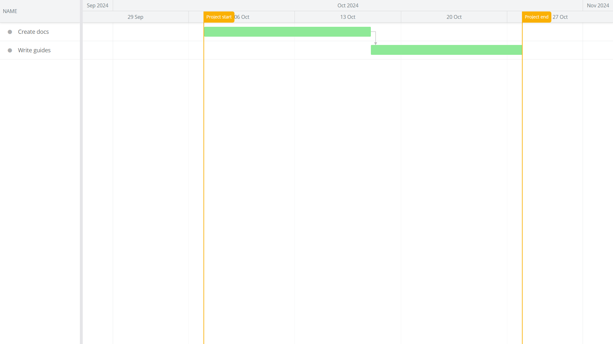

# How to connect and sync Bryntum Gantt to Microsoft Project

The code for the complete app is on the `completed-gantt` branch.

## Getting started

This starter repository uses [Vite](https://vitejs.dev/), which is a development server and JavaScript bundler. You’ll need Node.js version 18+ for Vite to work. 

Install the Vite dev dependency by running the following command: 

```sh
npm install
```

Install the Bryntum Gantt component by following the first two steps of the [guide to using the Bryntum npm repository](https://bryntum.com/products/gantt/docs/guide/Gantt/npm-repository) and step four of the [guide to setting up Bryntum Gantt with vanilla JavaScript and npm](https://bryntum.com/products/gantt/docs/guide/Gantt/quick-start/javascript-npm#install-component).

## Running the app

Run the local dev server using the following command:

```sh
npm run dev
```

You'll see a Bryntum Gantt with two tasks and one dependency between the tasks:


